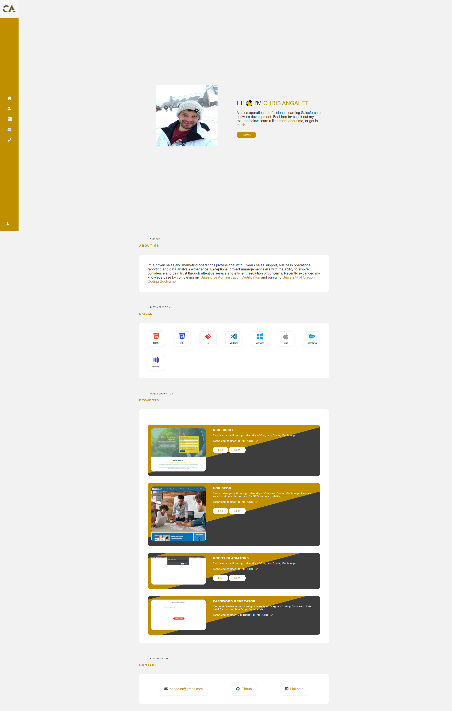

# Chris Angalet Portfolio

## Description

Welcome to my portfolio to learn a little more about me.  This portfolio is meant to highlight my development skills through this University of Oregon coding bootcamp. Learn more about me, view my projects, and contact me.

## Usage

## Links

Github Link: https://cangalet.github.io/chrisangalet/

### Inspiration:
- https://alexcalia.com/
- https://freefrontend.com/css-product-cards/
- https://fontawesome.com/v5.15/icons

